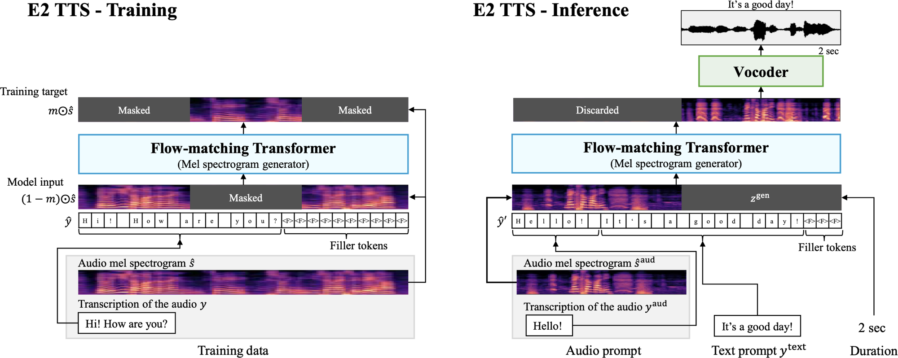

# E2 TTS — MLX

Implementation of E2-TTS, [Embarrassingly Easy Fully Non-Autoregressive Zero-Shot TTS](https://arxiv.org/abs/2406.18009v1), with the [MLX](https://github.com/ml-explore/mlx) framework.

This implementation is based on the [lucidrains implementation](https://github.com/lucidrains/e2-tts-pytorch) in Pytorch, which differs from the paper in that it uses a [multistream transformer](https://arxiv.org/abs/2107.10342) for text and audio, with conditioning done every transformer block.

## Installation

```bash
pip install mlx-e2-tts
```

## Usage

```python
import mlx.core as mx

from e2_tts_mlx.model import E2TTS
from e2_tts_mlx.trainer import E2Trainer
from e2_tts_mlx.data import load_libritts_r

e2tts = E2TTS(
    tokenizer="char-utf8",  # or "phoneme_en"
    cond_drop_prob = 0.25,
    frac_lengths_mask = (0.7, 0.9),
    transformer = dict(
        dim = 1024,
        depth = 24,
        heads = 16,
        text_depth = 12,
        text_heads = 8,
        text_ff_mult = 4,
        max_seq_len = 4096,
        dropout = 0.1
    )
)
mx.eval(e2tts.parameters())

batch_size = 128
max_duration = 30

dataset = load_libritts_r(split="dev-clean")  # or any audio/caption dataset

trainer = E2Trainer(model = e2tts, num_warmup_steps = 1000)

trainer.train(
    train_dataset = ...,
    learning_rate = 7.5e-5,
    batch_size = batch_size,
    total_steps = 1_000_000
)
```

... after much training ...

```python
cond = ...
text = ...
duration = ...  # from a trained DurationPredictor or otherwise

generated_audio = e2tts.sample(
    cond = cond,
    text = text,
    duration = duration,
    steps = 32,
    cfg_strength = 1.0,  # if trained for cfg
    use_vocos = True  # set to False to get mel spectrograms instead of audio
)
```

Note the model size specified above (from the paper) is very large. See `train_example.py` for a more practical-sized model you can train on your local device.

## Appreciation

[lucidrains](https://github.com/lucidrains) for the original implementation in Pytorch.

## Citations

```bibtex
@inproceedings{Eskimez2024E2TE,
    title   = {E2 TTS: Embarrassingly Easy Fully Non-Autoregressive Zero-Shot TTS},
    author  = {Sefik Emre Eskimez and Xiaofei Wang and Manthan Thakker and Canrun Li and Chung-Hsien Tsai and Zhen Xiao and Hemin Yang and Zirun Zhu and Min Tang and Xu Tan and Yanqing Liu and Sheng Zhao and Naoyuki Kanda},
    year    = {2024},
    url     = {https://api.semanticscholar.org/CorpusID:270738197}
}
```

```bibtex
@article{Burtsev2021MultiStreamT,
    title     = {Multi-Stream Transformers},
    author    = {Mikhail S. Burtsev and Anna Rumshisky},
    journal   = {ArXiv},
    year      = {2021},
    volume    = {abs/2107.10342},
    url       = {https://api.semanticscholar.org/CorpusID:236171087}
}
```

## License

The code in this repository is released under the MIT license as found in the
[LICENSE](LICENSE) file.
